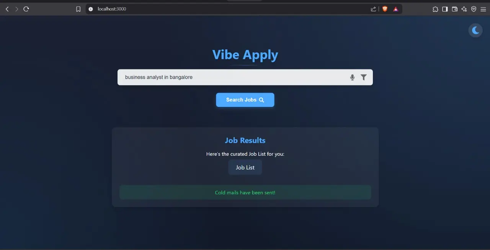
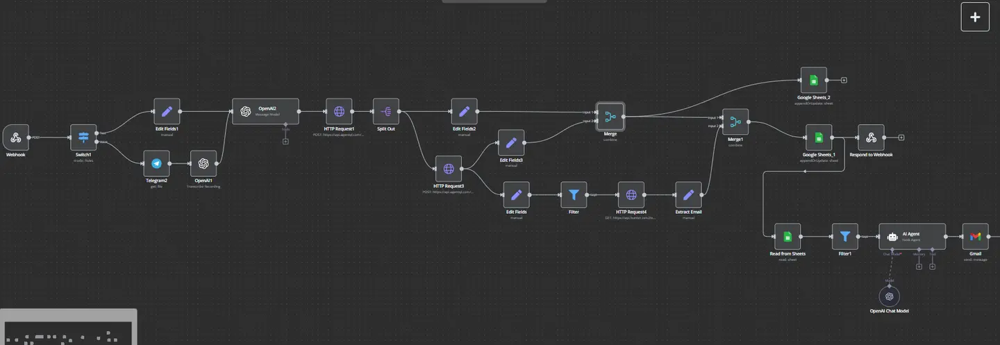
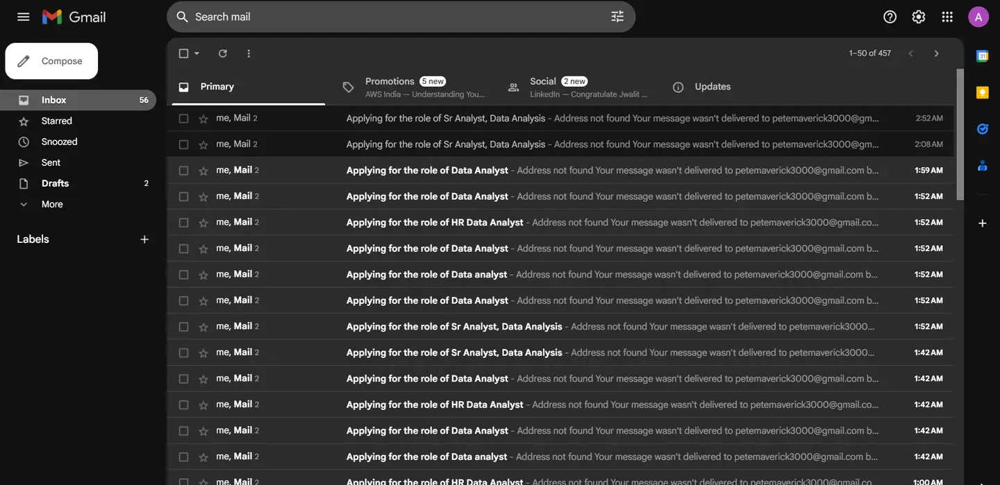
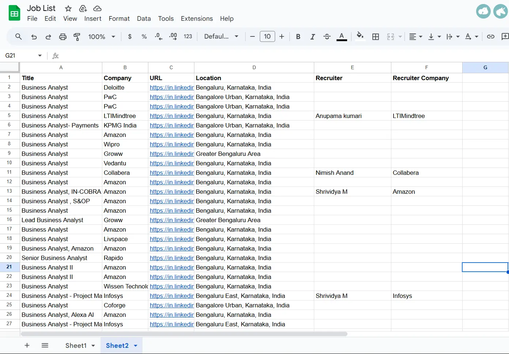

<div align="center">


<a href="https://devfolio.co/projects/vibe-apply-c25f">
  
</a>

<br/><br/>


<br/>


</div>

<br/>

## 🚀 Why We Built This

Job hunting in 2025 still feels like it's stuck in 2010. Open 20 tabs, refresh job boards, copy-paste the same cold email, hope it lands somewhere other than a recruiter's trash. It's exhausting, repetitive, and wildly inefficient — practically a full-time job just to find a job.

**Vibe Apply turns one sentence into a finished job-search sprint.**

<div align="center">

</div>

<br/>

## 😩 The Problem

<table align="center">
<tr>
<td width="25%" align="center">🕵️‍♂️<br/><b>Recruiter Hunt</b><br/><sub>Hours lost hunting for a hiring manager's email that isn't on LinkedIn or the careers page</sub></td>
<td width="25%" align="center">📋<br/><b>Manual Search</b><br/><sub>20+ tabs, endless refreshing, the same copy-paste on every application</sub></td>
<td width="25%" align="center">📨<br/><b>Generic Outreach</b><br/><sub>Identical cold emails to everyone, zero personalization, zero replies</sub></td>
<td width="25%" align="center">🗂️<br/><b>No Tracking</b><br/><sub>No record of where you applied, no follow-ups, missed opportunities</sub></td>
</tr>
</table>

<br/>

## ✨ What It Actually Does

```
you:  "Data Analyst in Bangalore"
```

<div align="center">

| Step | What happens |
|:---:|:---|
| 1️⃣ | Scrapes LinkedIn for matching, live job listings |
| 2️⃣ | Extracts title, company, location & URL — deduplicated |
| 3️⃣ | Digs up recruiter names straight from the listing |
| 4️⃣ | Finds their professional email address |
| 5️⃣ | Writes a personalized cold email with GPT-4o-mini |
| 6️⃣ | Sends it — no `Ctrl+V` required |
| 7️⃣ | Logs everything into one shareable Google Sheet |

</div>

<div align="center">
<sub>⏱️ From search to sent emails: <b>minutes</b>, not days.</sub>
</div>

<br/>

## 🏗️ Architecture

```mermaid
flowchart LR
    A["🎙️ User Input<br/>voice or text"] --> B["⚡ n8n Webhook /<br/>Telegram Trigger"]
    B --> C["🧠 GPT-4o-mini<br/>parse role + location"]
    C --> D["🕷️ AgentQL<br/>scrape LinkedIn jobs"]
    D --> E["🔁 Split & process<br/>each job"]
    E --> F["🕵️ AgentQL<br/>find recruiter"]
    F --> G["📧 Hunter.io<br/>find email"]
    G --> H["📊 Google Sheets<br/>append / update"]
    H --> I["✍️ GPT-4o-mini<br/>draft cold email"]
    I --> J["📤 Gmail<br/>send outreach"]
    J --> K["✅ Response back<br/>to user"]

    style A fill:#0EA5E9,color:#fff
    style K fill:#22C55E,color:#fff
    style C fill:#8B5CF6,color:#fff
    style I fill:#8B5CF6,color:#fff
```

<div align="center">



</div>

**Design philosophy:** workflow-first (no traditional backend server), event-driven, stateless — Google Sheets *is* the database.

<br/>

## 🖥️ See It In Action

<div align="center">

<b>1. One line in, results out</b><br/>


<br/><br/>

<b>2. The n8n orchestration engine</b><br/>


<br/><br/>

<b>3. Personalized outreach, sent automatically</b><br/>


<br/><br/>

<b>4. Every job & recruiter, tracked live</b><br/>


</div>

<br/>

## 🧠 Tech Stack

<div align="center">

| Layer | Tools |
|---|---|
| **Frontend** | React 18.2 · React Router 6.9 · Axios · Web Speech API |
| **Orchestration** | n8n (webhook + Telegram triggers) |
| **AI / NLP** | OpenAI GPT-4o-mini · Whisper (voice transcription) |
| **Scraping** | AgentQL (natural-language, JS-rendered page scraping) |
| **Email Discovery** | Hunter.io |
| **Storage** | Google Sheets API |
| **Alt. Interface** | Telegram Bot API |

</div>

<br/>

## 🎯 Key Innovations

- 🎙️ **Voice-to-Workflow** — speak your search, get results
- 🧩 **AI Query Parsing** — natural language → structured LinkedIn search
- 🕵️ **Recruiter Discovery at Scale** — names *and* emails, automatically
- 🔌 **Zero Backend** — n8n *is* the backend
- 📊 **Sheets as Database** — free, familiar, instantly shareable
- 🔀 **Multi-Channel** — same workflow via web app or Telegram bot

<br/>

## 📈 Impact

<div align="center">

| | Before Vibe Apply | After Vibe Apply |
|---|:---:|:---:|
| Time per application | 15–20 min | **~1 min for 20 jobs** |
| Applications per day | 5–10 | **100+/week** |
| Outreach | Generic | **Personalized, direct to recruiter** |
| Tracking | None | **Centralized Google Sheet** |

</div>

<br/>

## 👥 Team 9749 — Built at HackByte 3.0

<div align="center">

Harshith G &nbsp;•&nbsp; Kesav M &nbsp;•&nbsp; Abhinay B &nbsp;•&nbsp; Pardhesh M

<br/><br/>

<a href="https://devfolio.co/projects/vibe-apply-c25f">
  
</a>

</div>

<br/>

<div align="center">

<sub>Made with ❤️ for HackByte 3.0</sub>
</div>
